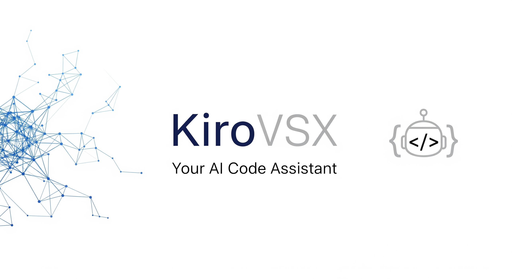

<h1 align="center">KiroVSX</h1>

**[KiroVSX](https://github.com/hscale/kirovsx) is an AI code assistant enhanced with Kiro methodology, built on Continue's architecture.
It provides progressive context building, institutional memory, and smart task management for developers.
Fork of Continue Dev with Kiro methodology integration.**

## 🚀 KiroVSX Features

### 📋 Progressive Context Building

KiroVSX implements Kiro's methodology with progressive context building through phases:

- **Requirements Phase**: Define what needs to be built
- **Design Phase**: Architect how it will be built
- **Tasks Phase**: Break down implementation steps

### 🧠 Institutional Memory

Enhanced with Kiro's steering system for maintaining project knowledge:

- **Steering Rules**: Project-specific guidelines and standards
- **Context Injection**: Automatic context awareness in AI conversations
- **Smart Rule Selection**: AI-powered selection of relevant institutional knowledge

### ⚡ Smart Task Management

- **Auto-generated Task Buttons**: Convert markdown tasks to executable actions
- **Task Queue**: Intelligent task prioritization and execution
- **Hook System**: Event-driven automation with natural language configuration

## Contributing

See [CONTRIBUTING.md](CONTRIBUTING.md) for information on how to contribute to the project.

## License

[Apache 2.0 © 2023-2024 Continue Dev, Inc.](./LICENSE)
